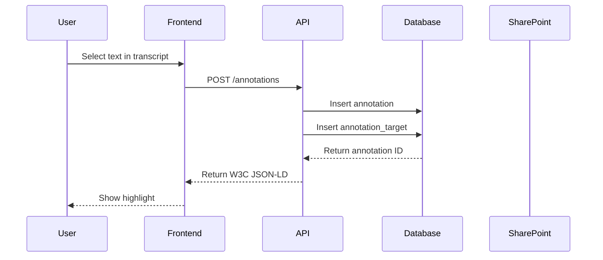
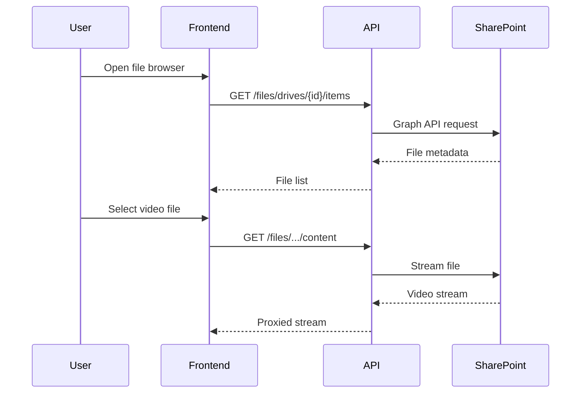

# Architecture Overview

Cluster follows a modern three-tier architecture with clear separation between the frontend, backend, and data storage layers.

## System Architecture

```
┌─────────────────────────────────────────────────────────────────────────┐
│                              Client                                      │
│  ┌─────────────────────────────────────────────────────────────────────┐│
│  │                     React SPA (Vite + TypeScript)                    ││
│  │  ┌─────────────┐  ┌─────────────┐  ┌─────────────┐  ┌─────────────┐ ││
│  │  │ File Browser│  │ Media Viewer│  │ Transcript  │  │  Synthesis  │ ││
│  │  │ (SharePoint)│  │ + Annotator │  │ Annotator   │  │    Canvas   │ ││
│  │  └─────────────┘  └─────────────┘  └─────────────┘  └─────────────┘ ││
│  └─────────────────────────────────────────────────────────────────────┘│
└─────────────────────────────────────────────────────────────────────────┘
                                    │
                                    │ HTTPS
                                    ▼
┌─────────────────────────────────────────────────────────────────────────┐
│                           Backend Services                               │
│  ┌─────────────────────────────────────────────────────────────────────┐│
│  │                     API Gateway (Node/Express + TypeScript)          ││
│  │                                                                      ││
│  │  /api/annotations/*     → W3C Protocol (CRUD, search, collections)  ││
│  │  /api/files/*           → SharePoint proxy (browse, stream, meta)   ││
│  │  /api/studies/*         → Research workflow (studies, insights)     ││
│  │  /api/auth/*            → Azure AD OAuth flow                       ││
│  └─────────────────────────────────────────────────────────────────────┘│
│                                    │                                     │
│                 ┌──────────────────┼──────────────────┐                 │
│                 ▼                  ▼                  ▼                 │
│  ┌─────────────────────┐  ┌─────────────────┐  ┌─────────────────────┐ │
│  │  Annotation Store   │  │  SharePoint     │  │  Search Index       │ │
│  │  (PostgreSQL)       │  │  Graph API      │  │  (Meilisearch)      │ │
│  └─────────────────────┘  └─────────────────┘  └─────────────────────┘ │
└─────────────────────────────────────────────────────────────────────────┘
```

## Core Principles

### 1. Data Sovereignty

Your research data stays in your control:

- **Source files** remain in SharePoint/Google Drive
- **Annotations** stored in your PostgreSQL database
- **No data** sent to third-party analytics or AI services

### 2. Standards-Based

Cluster uses open standards wherever possible:

- **W3C Web Annotation** for annotation data
- **OAuth 2.0 / OpenID Connect** for authentication
- **REST/JSON** for API communication
- **Media Fragments URI** for video/audio targeting

### 3. Separation of Concerns

| Layer | Responsibility | Technology |
|-------|---------------|------------|
| **Frontend** | User interface, interaction | React, TypeScript |
| **Backend** | Business logic, API | Node.js, Express |
| **Database** | Data persistence | PostgreSQL |
| **External** | File storage, auth | SharePoint, Azure AD |

## Data Flow

### Creating an Annotation



### Loading a File



## Monorepo Structure

```
cluster/
├── packages/
│   ├── shared/          # Shared TypeScript types and schemas
│   │   ├── src/
│   │   │   ├── types/   # W3C annotation types
│   │   │   └── schemas/ # Zod validation schemas
│   │   └── package.json
│   │
│   ├── server/          # Express API server
│   │   ├── src/
│   │   │   ├── routes/  # API endpoints
│   │   │   ├── services/# Business logic
│   │   │   ├── db/      # Database schema and migrations
│   │   │   └── middleware/
│   │   └── package.json
│   │
│   └── web/             # React frontend
│       ├── src/
│       │   ├── components/
│       │   ├── pages/
│       │   ├── api/     # API client
│       │   └── stores/  # State management
│       └── package.json
│
├── docs/                # This documentation (Docusaurus)
└── docker-compose.yml
```

## Security Model

### Authentication Flow

1. User clicks "Sign in with Microsoft"
2. MSAL.js redirects to Azure AD
3. User authenticates with their org credentials
4. Azure AD returns access token to frontend
5. Frontend sends token with API requests
6. Backend validates token with Azure AD
7. Backend uses token for SharePoint access (on-behalf-of)

### Multi-Tenancy

Cluster supports multiple organizations:

- Each Azure AD tenant = one organization
- All data filtered by `org_id`
- Users can only access their organization's data

### File Access

Cluster never stores files:

- Files accessed via Microsoft Graph API
- User's Azure AD permissions enforced
- If user can't access file in SharePoint, they can't access it in Cluster

## Next Steps

- [Tech Stack](/architecture/tech-stack) — Libraries and frameworks
- [Data Model](/architecture/data-model) — Database schema
