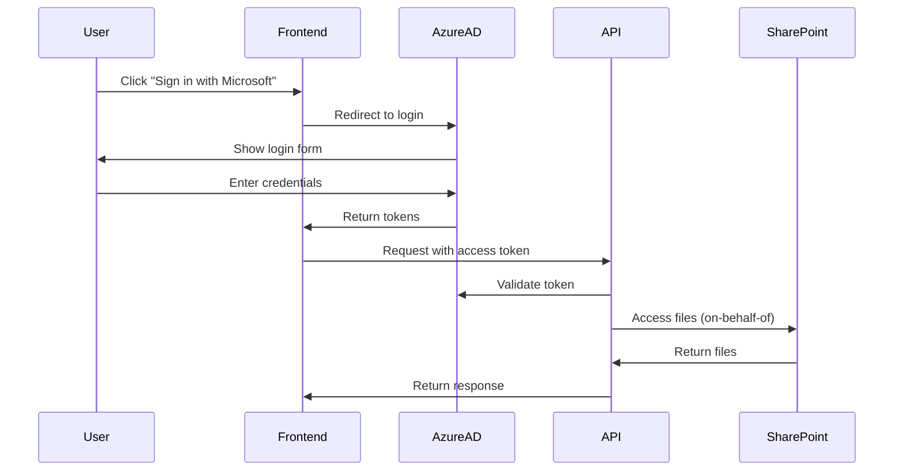

# Authentication Overview

Cluster uses OAuth 2.0 / OpenID Connect for authentication, supporting enterprise identity providers.

## Supported Providers

| Provider | Status | Use Case |
|----------|--------|----------|
| **Azure AD** | ✅ Supported | Microsoft 365 / Enterprise |
| **Google Workspace** | 🔜 Coming Soon | Google Drive integration |

## How Authentication Works



### Token Flow

1. **Frontend (MSAL.js)** initiates login
2. **Azure AD** authenticates user and returns tokens
3. **Frontend** stores tokens and sends with API requests
4. **Backend** validates tokens and uses on-behalf-of flow for SharePoint

## Multi-Tenant Architecture

Cluster supports multiple organizations:

```
┌─────────────────────────────────────────────────────────────┐
│                        Cluster                               │
│  ┌─────────────┐  ┌─────────────┐  ┌─────────────┐          │
│  │   Org A     │  │   Org B     │  │   Org C     │          │
│  │ (Tenant A)  │  │ (Tenant B)  │  │ (Tenant C)  │          │
│  └─────────────┘  └─────────────┘  └─────────────┘          │
│         │                │                │                  │
│         ▼                ▼                ▼                  │
│  ┌─────────────────────────────────────────────────────────┐│
│  │                    PostgreSQL                            ││
│  │  org_id filtering ensures data isolation                 ││
│  └─────────────────────────────────────────────────────────┘│
└─────────────────────────────────────────────────────────────┘
```

Each Azure AD tenant creates a separate organization in Cluster. Users can only see data from their organization.

## Required Permissions

### Azure AD (Delegated)

| Permission | Purpose |
|------------|---------|
| `User.Read` | Read signed-in user profile |
| `Files.Read.All` | Read all files user can access |
| `Sites.Read.All` | List SharePoint sites |

### Google (Planned)

| Scope | Purpose |
|-------|---------|
| `userinfo.profile` | Read user profile |
| `drive.readonly` | Read Google Drive files |

## Security Features

### Token Validation

All API requests are validated:

```typescript
// Middleware validates JWT
const decoded = await validateToken(req.headers.authorization);
if (!decoded) {
  return res.status(401).json({ error: 'Invalid token' });
}
```

### Organization Isolation

Every database query filters by organization:

```typescript
const annotations = await db
  .select()
  .from(annotations)
  .where(eq(annotations.orgId, req.orgId)); // Always filtered
```

### Session Management

- Tokens are validated on every request
- Sessions expire after 24 hours (configurable)
- HTTPS required in production

## First-Time Login

When a user logs in for the first time:

1. Cluster creates an **organization** (if new Azure AD tenant)
2. Cluster creates a **user** record
3. User is associated with their organization
4. Subsequent logins update the user profile

```typescript
// Automatic user/org provisioning
const org = await findOrCreateOrganization(tenantId, tenantName);
const user = await findOrCreateUser(org.id, azureUserId, email);
```

## Logout

Logout clears both local and Azure AD sessions:

```typescript
// Frontend
await msalInstance.logoutPopup();
localStorage.clear();
```

## Next Steps

- [Azure AD Setup](/authentication/azure-setup) — Configure Microsoft authentication
- [Google Setup](/authentication/google-setup) — Configure Google authentication (coming soon)
